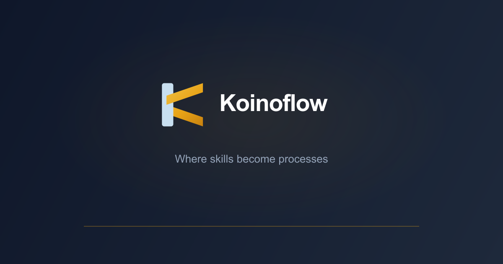

<p align="center">
  
</p>

<h1 align="center">Koinoflow</h1>

<p align="center">
  <em>Koino (κοινό) · shared knowledge in motion.</em>
</p>

<p align="center">
  <strong>Version-controlled operational skills for humans and AI agents.</strong>
</p>

<p align="center">
  <a href="https://koinoflow.com"></a>
  <a href="LICENSE"></a>
  <a href="https://github.com/visionect/Koinoflow/actions/workflows/ci.yml"></a>
  <a href="https://github.com/visionect/Koinoflow/pkgs/container/koinoflow%2Fbackend"></a>
</p>

---

Koinoflow is a B2B platform where an organization writes, versions, and
governs its operational skills — then exposes that approved knowledge to
people through a web app and to AI agents through the [Model Context
Protocol (MCP)](https://modelcontextprotocol.io). When a developer asks
their editor "how do we ship a release?" or a support agent asks "what's
our refund policy?", the answer comes from the latest approved version of
your skill, not a stale wiki page.

> Status: early development. APIs, schemas, and data models may change.

## Features

- **Skill authoring with Tiptap.** A clean Markdown-first editor with
  diffs, revisions, comments, and approval workflows.
- **Version history as a first-class object.** Every change is an
  immutable version with an author, a commit message, and an optional
  approval gate before it becomes the "current" version.
- **Organizations → teams → departments → skills.** A workspace model
  that mirrors how real companies organize operational knowledge.
- **MCP server, remote and local.** Expose skills to any MCP-capable
  client (Claude Desktop, Cursor, Codex, etc.) over Streamable HTTP
  (hosted) or stdio (local npm package).
- **OAuth sign-in.** Google and GitHub via `django-allauth`.
- **Staleness alerts + skill audit rules.** Know when a skill hasn't
  been reviewed in N days.
- **Usage analytics.** See which skills are being read, who's reading
  them, and via which MCP client.
- **Billing-optional.** Ships with `ENABLE_BILLING=False` out of the box
  so self-hosters never see a trial banner or paywall.

## Architecture

| Layer            | Stack                                                   |
| ---------------- | ------------------------------------------------------- |
| Backend API      | Django 5 + Django Ninja, PostgreSQL, Redis              |
| Background jobs  | Celery (abstracted so Cloud Tasks can be swapped in)    |
| Auth             | django-allauth (Google + GitHub OAuth)                  |
| MCP server       | Python MCP SDK over Streamable HTTP                     |
| MCP (local pkg)  | TypeScript, `@modelcontextprotocol/sdk`, stdio          |
| Frontend         | React 19 + Vite + TypeScript (strict) + TanStack Query  |
| UI components    | shadcn/ui (Radix + Tailwind)                            |
| Editor           | Tiptap                                                  |
| API codegen      | `@hey-api/openapi-ts`                                   |
| Tests            | pytest (backend) · Vitest + Playwright (frontend)       |
| Local infra      | Docker Compose                                          |

Repo layout:

```
backend/        Django project (config/, apps/)
frontend/       React + Vite SPA
mcp-server/     Remote MCP server (Python, Streamable HTTP)
mcp-package/    Local MCP server (TypeScript, stdio, npm-publishable)
infra/          docker-compose.yml for local dev
```

## Quick start (local development)

Requires Docker, Docker Compose, and `make`.

```bash
git clone https://github.com/visionect/Koinoflow.git
cd Koinoflow
make setup      # copies .env, builds images, migrates, creates superuser
make up         # starts backend, frontend, postgres, redis, mcp-server
```

- Frontend: http://localhost:5173
- Backend API: http://localhost:8000/api/v1
- API docs (Swagger-style): http://localhost:8000/api/v1/docs
- Django admin: http://localhost:8000/admin/ (sign in with the superuser `make setup` created for you)
- MCP server: http://localhost:8001/mcp

Other common targets — run `make help` for the full list:

```bash
make migrate           # apply Django migrations
make makemigrations    # generate new migrations
make test              # backend tests
make lint              # ruff check + format check
make fmt               # auto-format with ruff
make down              # stop services
make clean             # stop + remove volumes
```

## Configuration

All configuration is via environment variables. Copy `.env.example` to
`.env` and edit. Highlights:

| Variable                  | Default                | Purpose                                           |
| ------------------------- | ---------------------- | ------------------------------------------------- |
| `DJANGO_SECRET_KEY`       | *(required)*           | Django secret key                                 |
| `DEBUG`                   | `True`                 | Django debug mode                                 |
| `DATABASE_URL`            | *(required)*           | Postgres connection string                        |
| `REDIS_URL`               | *(required)*           | Redis connection string                           |
| `DEFAULT_FROM_EMAIL`      | `noreply@example.com`  | Default email sender                              |
| `INVITATION_FROM_EMAIL`   | = `DEFAULT_FROM_EMAIL` | Sender for team-invite emails                     |
| `ALERTS_FROM_EMAIL`       | = `DEFAULT_FROM_EMAIL` | Sender for staleness-alert emails                 |
| `RESEND_API_KEY`          | *(empty)*              | Resend API key (for transactional email)          |
| `ENABLE_BILLING`          | `False`                | Turn on trial/subscription gating (hosted only)   |
| `GOOGLE_OAUTH_CLIENT_ID`  | *(optional)*           | Google sign-in                                    |
| `GITHUB_OAUTH_CLIENT_ID`  | *(optional)*           | GitHub sign-in                                    |

## Self-hosting with pre-built images

Every push to `main` publishes multi-arch Docker images to the GitHub
Container Registry:

```
ghcr.io/visionect/koinoflow/backend:latest
ghcr.io/visionect/koinoflow/mcp-server:latest
```

Tagged releases (`vX.Y.Z`) also publish `:X.Y.Z` and `:X.Y` tags. The
images are public — no login required to pull.

## Running the MCP server against your instance

The local MCP package (TypeScript, stdio) lets any MCP client talk to your
Koinoflow deployment. See [`mcp-package/README.md`](mcp-package/README.md)
for install + editor configuration (Claude Desktop, Cursor, Codex, etc.).

```jsonc
{
  "mcpServers": {
    "koinoflow": {
      "command": "npx",
      "args": ["-y", "@koinoflow/mcp"],
      "env": {
        "KOINOFLOW_API_URL": "https://your-koinoflow.example.com/api/v1",
        "KOINOFLOW_API_KEY": "kn_..."
      }
    }
  }
}
```

## Contributing

We welcome issues and pull requests. Please read
[CONTRIBUTING.md](CONTRIBUTING.md) for the development workflow and
[CODE_OF_CONDUCT.md](CODE_OF_CONDUCT.md) before participating.

## Security

If you believe you've found a security issue, please read
[SECURITY.md](SECURITY.md) for coordinated disclosure instructions. Do not
file a public GitHub issue for vulnerabilities.

## License

Koinoflow is released under the [MIT License](LICENSE).

The **Koinoflow** name and logo are trademarks of Visionect d.o.o. — see
[TRADEMARK.md](TRADEMARK.md) for guidance on acceptable use.

## Hosted vs. self-hosted

You can run Koinoflow entirely on your own infrastructure using the
instructions above — that's the default mode and it's free forever under
MIT. If you'd rather not operate it yourself, a managed hosted service is
available at [koinoflow.com](https://koinoflow.com).

## Sponsorship

Active development of Koinoflow is sponsored by
[Visionect](https://www.visionect.com), which also operates the hosted
service at [koinoflow.com](https://koinoflow.com). The project remains
open-source; sponsorship funds full-time engineering and community
support.
